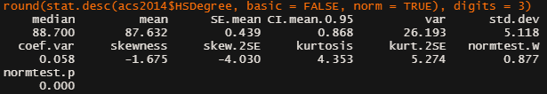

```{r installs, include = FALSE}

# setwd("C:/Users/micha/OneDrive/Documents/GitHub/DSC520/")
acs2014 <- read.csv("data/acs-14-1yr-s0201.csv", header = TRUE)
# 
# install.packages("ggplot2")
# install.packages("psych")
# install.packages("pastecs")
# 
library(ggplot2)
library(psych)
library(pastecs)

```

## 2.1 Assignment: 2014 American Community Survey

### 1. What are the elements in your data (including the categories and data types)?

```{r 1-elements, acs2014}

class(acs2014$Id)
class(acs2014$Id2)
class(acs2014$Geography)
class(acs2014$PopGroupID)
class(acs2014$POPGROUP.display.label)
class(acs2014$RacesReported)
class(acs2014$HSDegree)
typeof(acs2014$HSDegree)
class(acs2014$BachDegree)
typeof(acs2014$BachDegree)

```

### 2. Please provide the output from the following functions: str(); nrow(); ncol()
 
```{r 2-str-nrow-ncol}

str(acs2014)
nrow(acs2014)
ncol(acs2014)

```

### 3. Create a Histogram of the HSDegree variable using the ggplot2 package.
    
```{r 3-histogram}

acs14Histogram <- ggplot(acs2014, aes(HSDegree))
acs14Histogram + geom_histogram()

```

####    a. Set a bin size for the Histogram.

```{r 3a-histbin}

acs14Histogram + geom_histogram(binwidth = 1)
acs14Histogram <- acs14Histogram + geom_histogram(binwidth = 1)

```

####    b. Include a Title and appropriate X/Y axis labels on your Histogram Plot.

```{r 3b-labs}

acs14Histogram + labs(x = "% with High School Degree", y = "Count", 
                      title = "High School Degrees, 2014")
acs14Histogram <- acs14Histogram + 
  labs(x = "% with High School Degree", y = "Count", 
       title = "High School Degrees, 2014")

```

### 4. Answer the following questions based on the Histogram produced:

####    a. Based on what you see in this histogram, is the data distribution unimodal?

> The data distribution appears to be unimodal, somewhere around 89-90%.

####    b. Is it approximately symmetrical?

> The data appears to be negatively skewed, not symmetrical.

####    c. Is it approximately bell-shaped?

> Though skewed, the data does appear approximately bell-shaped.

####    d. Is it approximately normal?

> I would say the skew deviates the curve from a normal distribution,
but the text says that 'the sampling distribution will tend to be normal
regardless of the population distribution in samples of 30 or more. Based 
on this criteria, I would say it is a normal distribution because we have
137 samples.

####    e. If not normal, is the distribution skewed? If so, in which direction?

> The data is clustered toward the higher end and so is negatively skewed.

####    f. Include a normal curve to the Histogram that you plotted.

```{r curve}

acs14Density <- ggplot(acs2014, aes(HSDegree)) + 
  geom_histogram(aes(y = ..density..), binwidth = 1) + 
  labs(x = "% with High School Degree", y = "Density", 
       title = "High School Degrees, 2014") + 
  stat_function(fun = dnorm, args = list(mean = mean(acs2014$HSDegree), 
                                         sd(acs2014$HSDegree)))
acs14Density

```

####    g. Explain whether a normal distribution can accurately be used as a model for this data.

> The normal curve does not appear to fit the data very well; it appears
non-symmetrical and to be negatively skewed. Additionally, it appears not to 
fit the normal curve very well as the data is too pointy (positive kurtosis).

### 5. Create a Probability Plot of the HSDegree variable.

```{r qplot}

qq.acs14.HSDegree <- qplot(sample = acs2014$HSDegree)
qq.acs14.HSDegree

```

### 6. Answer the following questions based on the Probability Plot:

####    a. Based on what you see in this probability plot, is the distribution approximately normal? Explain how you know.

> This distribution does not appear normal. If the data matched a normal
distribution, we would expect the points to form a straght line. Devations
from this line indicate deviations from normality.

####    b. If not normal, is the distribution skewed? If so, in which direction? Explain how you know.

> The data deviates from normal creating an upward curve, which indicates the 
data is clustered toward the high end of the scale, or negatively skewed.


### 7. Now that you have looked at this data visually for normality, you will now quantify normality with numbers using the stat.desc() function. Include a screen capture of the results produced.

```{r statdesc}

round(stat.desc(acs2014$HSDegree, basic = FALSE, norm = TRUE), digits = 3)

```



### 8. In several sentences provide an explanation of the result produced for skew, kurtosis, and z-scores. In addition, explain how a change in the sample size may change your explanation?

> In a normal distribution, we would expect the values for skew and kurtosis to
be at or very near zero. In these results, there is a negative skewness (-1.675)
indicating the overall scores tend toward the higher end. Kurtosis is positive
(4.353) indicating a pointy and heavily-tailed distribution. The z-scores for
each are related to the skew.2SE and kurt.2SE values. For smaller sample sizes, 
one might look at these and say that they are significant if they are >2,
however we have well over 200 samples in our data set, which will make these
appear more significant than they are. Because of this, we should not use 
z-scores as a metric and instead rely more on the skew and kurtosis values as
well as visually inspecting the histogram.

